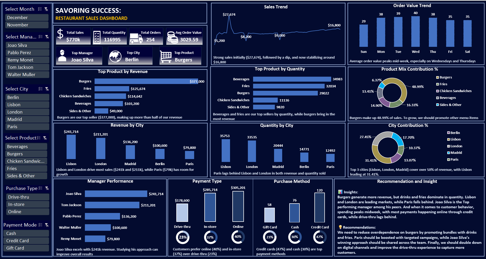

# 🍽 Savoring Success: Restaurant Sales Dashboard  

  

## 📌 Project Overview  
This project digs into restaurant sales data to reveal key insights: top-selling meals, city performance, and manager effectiveness. By analyzing sales trends, we can identify what's working, what's not, and where opportunities lie. The goal is to turn data into actionable stories, highlighting wins, identifying gaps, and driving future success. This dashboard is designed to help restaurants savor more success by making informed decisions  

---

## 🛠 Data & Methodology  
- *Source:* [Restaurant Sales Data (Kaggle)](https://www.kaggle.com/datasets/rohitgrewal/restaurant-sales-data)  
- *Metrics Captured:* Revenue, orders, quantity sold, product categories, managers, purchase methods, and payments.  
- *Tool Used:* Microsoft Excel for cleaning, transformation, and visualization.  
- *Method:*  
  - Cleaned and transformed raw restaurant sales data.  
  - Created KPIs: Total Sales, Total Quantity, Total Orders, Average Order Value.  
  - Built interactive dashboard with slicers for filtering by city, manager, product, and purchase method.  

---

## 📊 Dashboard Features  
Think of this dashboard as the *kitchen pass* — where the whole restaurant’s performance is plated up for leadership to see:  
- *KPI Board:* $770K total sales, 117K items sold, 254 orders, Avg. Order Value $3,029.59.  
- *Sales Trend:* Early spike ($27K+) followed by stable flow around $16K.  
- *Product Mix:* Burgers are the revenue champions ($377K), while beverages and fries dominate by volume.  
- *City Insights:* Lisbon & London lead the table; Paris struggles to keep up.  
- *Manager Insights:* Joao Silva is the standout performer with $241K sales.  
- *Customer Habits:* Most sales come in-store (40%), with credit card payments leading (47%).  
- *Order Patterns:* Mid-week purchases peak in order value (Wednesdays & Thursdays).  

---

## 🔑 Key Insights  

*1. The Burger Effect 🍔*  
Burgers are the biggest money-maker, contributing almost half of total revenue ($377K). They are the star of the menu and the main reason customers visit the restaurant.  
*2. Drinks & Fries 🥤🍟*  
Drinks (34,983 units) and fries are ordered more than burgers, but they bring in less money because of their lower price. They are very popular and can be bundled with burgers to increase both sales volume and revenue.  
*3. City Divide 🌍*  
Lisbon ($241K) and London ($211K) lead in sales, showing strong customer demand. Paris is the weakest performer with only $79K, which means there’s room for better marketing, offers, or menu adjustments in that market.  
*4. Manager Performance 👨‍💼*  
Joao Silva stands out with $241K in sales — far ahead of other managers. His results show that his approach works, and his methods can be shared across other branches to boost performance.  
*5. Customer Behavior 🛒*  
- *Where they buy:* Most customers dine *in-store (40%)*, while online and drive-thru orders are still underused.  
- *How they pay:* Credit cards (47%) are the top payment method, while cash and gift cards are less popular but could grow with the right offers.  
*6. Time Trends ⏰*  
Sales peak in the middle of the week, especially on *Wednesdays and Thursdays*. Weekends are quieter, showing an opportunity to introduce weekend promotions or offers.

---

## 🚀 Recommendations  
- *Bundle to Boost Sales:* Pair burgers with beverages & fries to increase average order value.  
- *Revive Paris Sales:* Launch targeted marketing and menu campaigns to boost performance.  
- *Share Best Practices:* Replicate Joao Silva's successful approach across all managers.  
- *Push Digital Channels:* Incentivize online & drive-thru orders with promotions.  
- *Diversify Payments:* Encourage cash and gift card use with discounts or loyalty rewards.  

---

## 📖 How to Use This Dashboard  

1. *Download the Excel file* from this repository.  
2. Open it in *Microsoft Excel (2016 or later recommended)*.  
3. Use the *slicers/filters* to explore the data by:  
   - City (Lisbon, London, Madrid, Berlin, Paris)  
   - Manager  
   - Product Category (Burgers, Fries, Beverages, etc.)  
   - Purchase Method (In-store, Online, Drive-thru)  
   - Payment Method (Credit card, Cash, Gift card)  
4. Navigate through the visuals to view:  
   - Overall KPIs (Total Sales, Quantity, Orders, Avg. Order Value)  
   - Sales trends over time  
   - City and manager comparisons  
   - Product performance (by revenue and by quantity)  
   - Customer purchase behavior
  
   ---
   

## ✍ Author  
*Ifeanyi Eric*  
- 📊 Data Analyst | Skilled in Excel, SQL, Power BI, and Tableau  
- 🌍 Nigeria 
- 🔗 [LinkedIn](https://www.linkedin.com/in/ifeanyieric)  
- ✉ ifeanyiokoronkwo52@gmail.com  

